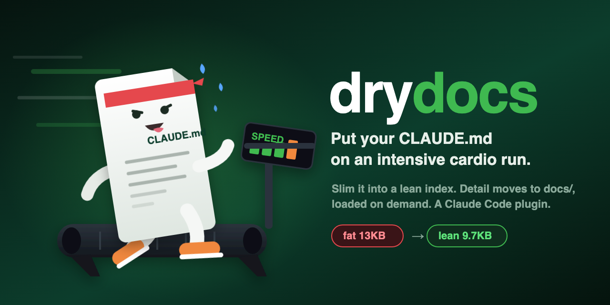

# drydocs



**Slim your `CLAUDE.md` into a lean index.** `CLAUDE.md` loads into an AI coding agent's context *every session* when it grows into a monolith of rules, specs, and pattern catalogs, every turn pays for detail it doesn't need. 

Drydocs turns it into a **lean index** (identity + always-apply rules + pointers) and moves the bulk into a well-organized `docs/` folder that loads **on demand**.

*"drydocs" = DRY, applied to docs.* Works on **any** repo. Distributed as a Claude Code plugin.

## What it does

- **Analyzes** your `CLAUDE.md`, classifies each section as *keep-as-index* vs *extract*.
- **Extracts** the heavy sections into atomic notes under `docs/`, replacing each with a short pointer.
- **Organizes** the notes with a documented method (below): creating `docs/` if missing, merging into
  it if present.
- **Keeps references intact.** When it moves a block, it repoints the docs/agents that referenced it.
- Leaves `CLAUDE.md` as a small, fast index.

### Grounded in three established methods
- **MOC (Maps of Content):** `CLAUDE.md` becomes the *root MOC*, a hub of links + the always-apply
  rules. (Nick Milo / *Linking Your Thinking*.)
- **Zettelkasten:** each extracted block is an *atomic, linked note*; existing coverage is *linked*, not
  duplicated. (Niklas Luhmann's slip-box.)
- **PARA:** `docs/` folders organize by *actionability*: `projects/`, `areas/`, `resources/`,
  `archive/`. (Tiago Forte / *Building a Second Brain*.)

## Non-destructive by design

drydocs **never touches your live `CLAUDE.md`.** A run produces just one new file plus the notes:
- `dry-CLAUDE.md`: the proposed lean version.
- the extracted notes under `docs/`.

Your original `CLAUDE.md` stays exactly as it is (git keeps its history, so no backup copy is needed).
Review, then promote when ready:
```bash
git diff --no-index CLAUDE.md dry-CLAUDE.md   # review the change
mv dry-CLAUDE.md CLAUDE.md                     # activate the lean version (old one stays in git)
# or: rm dry-CLAUDE.md                          # discard (git revert <commit> also drops the notes)
```

## Install

```
/plugin marketplace add johanes/drydocs
/plugin install drydocs@cardio
```
Then, in any repo you want to slim:
```
/drydocs
```

## How to use

Invoke `/drydocs` (or just say "slim my CLAUDE.md"). The skill:
1. analyzes your `CLAUDE.md` and reports what it keeps vs extracts, with the projected token savings;
2. runs the full flow non-destructively, leaving your `CLAUDE.md` untouched: produces `dry-CLAUDE.md` + the organized notes as **one git commit**;
3. leaves the final `mv dry-CLAUDE.md CLAUDE.md` to you, and tells you how to review, promote, or revert.

It refuses to run outside a git repository (git is the undo mechanism).

## The helper

The skill drives a stdlib-only Python helper you can also run directly:

```
plugins/drydocs/scripts/slim_claude_md.py
  outline FILE                       parse into sized sections (JSON)
  refs    --heading H                find references to a section (JSON)
  extract dry-CLAUDE.md --heading H --into docs/…   move a section to a note, leave a pointer stub
  moc     --root dry-CLAUDE.md       (re)generate the grouped link index
  begin   / finalize                 make the working copy / report size drop + review-promote help
  stamp   FILE --tipo … --area …     prepend minimal frontmatter
```
Everything defaults to **dry-run**; add `--apply` to write. It refuses outside a git tree and never
creates a file named `CLAUDE.md`.

## Safety

- Non-destructive (your `CLAUDE.md` is untouched; you promote manually), idempotent (re-runs are no-ops),
  fully `git revert`-able.
- Touches only Markdown / agent-instruction files. Never your application source or config.
- No RAG, embeddings, or vector index; navigation is links + the index + grep.

## License

MIT. See [LICENSE](LICENSE).
